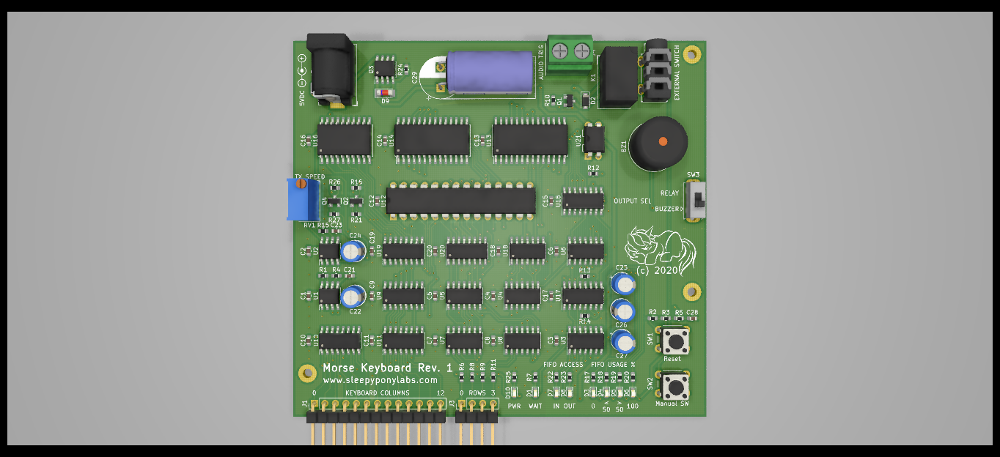

# Morse Keyboard (Matrix Version)
This is a Morse Code Keyboard that's built only with common logic ICs. 

**Note: While I'm trying to follow morse code standard, I did not guaranteed that it will conform to ham radio standards and regulations. Use at your own risk.**

## Features

- Outputs full english alphabets, numbers, and 12 control codes.
- Built-In Keyboard Encoder circuit, connects any keypad matrix to the board to get started.
- 512 characters FIFO buffer.
- Manual Switch
- External key connector.
- Output buzzer and relay.

## Licensing

Hardware is licensed under `SPDX-License-Identifier: Apache-2.0 WITH SHL-2.1`

Documentation is licensed under `SPDX-License-Identifier: CC-BY-SA-4.0`
